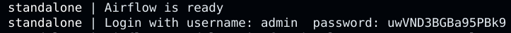
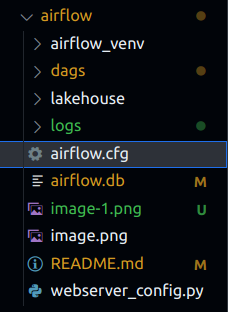
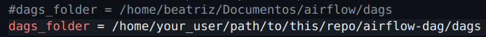

### Exercise instructions:
The goal is to create a DAG to create a medallion architecture with its 4 directories:
- landing (where the original json files will be storage)
- bronze (transform from json to parquet)
- silver (exclude the prefix from the column names)
- gold (join the 3 dataframes in one with especific columns)

Step by step:
1. Install airflow (read below the instructions to install and to run airtflow)
2. Create the landing directory with the json files (customers, orders and orders_items) inside of it
3. Create 1 Python script with 3 different funcitons, one for each transformation step (as I did in 'tarefas.py')
4. Create an airflow dag to execute all the python scripts parallelizing the bronze and silver executions
5. Store the results in a AWS S3 Bucket

### Installing airflow
1. Update the system
- `sudo apt update`
- `sudo apt upgrade`

2. Install Python and its dependencies
- `sudo apt install python3.10 python3.10-venv python3.10-dev`

3. Install and configure virtual environment
- `python3.10 -m venv airflow_venv`
- `source airflow_venv/bin/activate`

4. Install airflow
- `export AIRFLOW_HOME=~/Documentos/airflow` (~/Documentos/airflow is the path to **my airflow directoy**, change it to yours)
- `pip install apache-airflow==2.9.0 --constraint "https://raw.githubusercontent.com/apache/airflow/constraints-2.9.0/constraints-3.10.txt"`

### Installing Spark
1. Update the system
- `sudo apt update`
- `sudo apt upgrade`

2. Install Java
- `sudo apt install default-jdk`

3. Download Apache Spark
- Go to [Apache downloads](https://spark.apache.org/downloads.html) and download the last version
- Extract the file using `tar xvf spark-*`
- Move the file to the /opt/ directory `sudo mv spark-* /opt/spark` 

### Configurations to use AWS
1. Download hadoop-aws and aws-java-sdk JARS
- `wget https://repo1.maven.org/maven2/org/apache/hadoop/hadoop-aws/3.3.4/hadoop-aws-3.3.4.jar`
- `wget https://repo1.maven.org/maven2/com/amazonaws/aws-java-sdk-bundle/1.12.508/aws-java-sdk-bundle-1.12.508.jar`

2. Move both of them to the Spark jars directory (usually /opt/spark/jars)
  

3. Configure your AWS credentials:
- Use `aws configure` to configure by the terminal
or
- Export the variables:
`export AWS_ACCESS_KEY_ID=YOUR_ACCESS_KEY_ID`
`export AWS_SECRET_ACCESS_KEY=YOUR_SECRET_ACCESS_KEY`
`export AWS_SESSION_TOKEN=YOUR_AWS_SESSION_TOKEN`

4. Don't forget to change the important infos from my code to yours!
- tarefas.py: lines 9, 10, 17 and 32 
- dag2.py: line 24

### Initializing airflow 
**These steps should be done every time you initialize your airflow!**

1. Open the terminal in your airflow directory (in **my** case: ~/Documentos/airflow) and activate the venv:
`source airflow_venv/bin/activate` 
 

2. Configure the environment variable (or you can add the path to your ".bashrc", so you can skip this step)
`export AIRFLOW_HOME=~/Documentos/airflow` 
 

3. Initialize airflow:
`airflow standalone`
- The login and password informations will apear like the image below (or you can find your password in 'standalone_admin_password.txt' file)

4. Open the url to access your airflow UI:
http://localhost:8080
 

5. Configure your AWS variables:
- Go to "Admin > Variables" and create 3 variables: AWS_ACCESS_KEY_ID, AWS_SECRET_ACCESS_KEY and AWS_SESSION_TOKEN with your credentials
- Go to "Admin > Connections > aws_default > Edit record" and add your AWS_ACCESS_KEY_ID e AWS_SECRET_ACCESS_KEY credentials

6. **Now you can finally trigger your DAG!**
 

7. At the end, always turn off your airflow application using the following commands on terminal:
- ctrl + C
- `deactivate`

### Last configurations 
1. Open the "airflow.cfg" file in your IDE

2. Comment out the existing dags_folder line and replace it with a new line specifying your dags folder path:
